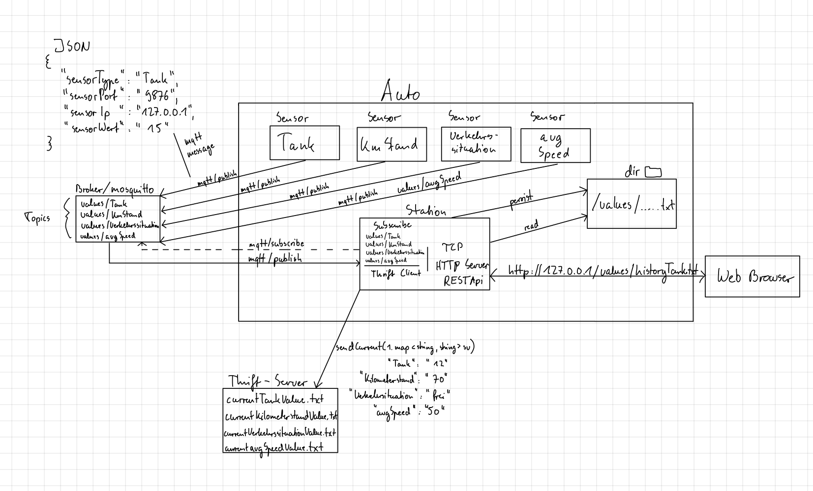
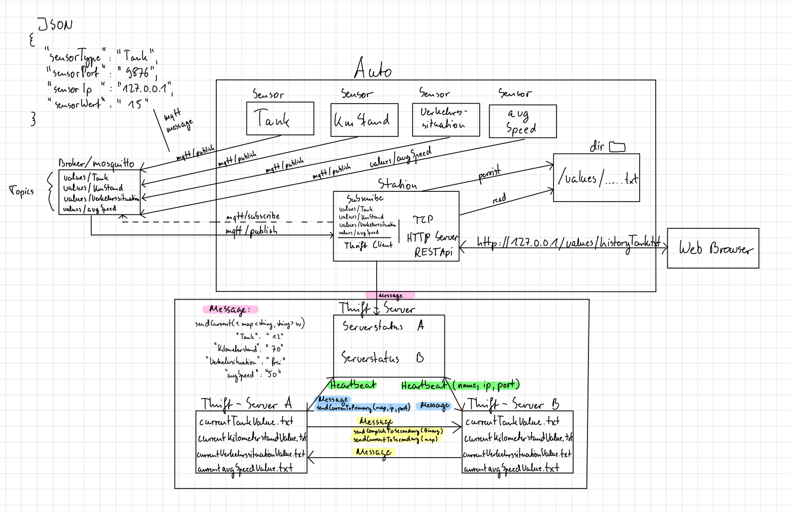

# Verteilte Systeme - Praktikum - Connected Cars

### Allgemein

In einem Auto(Subsystem) befinden sich vier Sensoren(Clients) und eine Zentrale die als Server ihre Aufgabe leistet. Die Sensoren versorgen im zwei Sekundentakt die Zentrale mit Daten, welche über UDP übertragen werden.
Dort werden die Nachrichten unter Angabe von IP, Port und Typ des Sensors auf der Standardausgabe ausgegeben.

Die Zentrale dient ebenfalls als ein HTTP-Server, damit man über ein Webbrowser, die Daten der Sensoren verfolgen kann. Die Kommunikation geschieht über TCP-HTTP (Socket).  
Später werden die Sensordaten vom Zentralserver, an einen Service Provider übermittelt, wo die Daten dann redundant ausgelegt werden sollen.

Abbildung 1 zeigt eine grobe Übersicht des Systems welches vorgegeben wurde.

_Abbildung 1 - Vorgegebenes Systemdesign_

___
### __Anforderungsanalyse__  
 

__Festlegung der Meilensteine:__  
__1. Meilenstein (15.12.2020): Aufgabe 1 und 2. Lauffähig, Protokolliert und getestet.__

- Vier Sensoren(Clients/Prozesse) die mittels UPD Socket mit dem Zentralserver kommunizieren:

- Tanksensor;Kilometerstand;Verkehrssituation;Durschnittsgeschwindigkeit

- Sensorwerte ändern sich ständig

- Übertragung alle zwei Sekunden
                
- Nachrichtenformat: JSON

- Eine Zentrale(Server/Prozess) dient als UDP-Server und HTTP-Server:

- Empfängt von Sensoren Nachrichten (per UDP Socket) die mit Angabe von IP, Port und Typ des Sensors auf der Standardausgabe ausgegeben werden. Diese werden zusätzlich in einer einfachen Form abgespeichert.

- Sensorwerte werden langfristig abgespeichert um Sensordaten jederzeit abrufen zu können.
                
- Ebenfalls dient der Server als HTTP-Schnittstelle mit HTTP GET, der über REST-API zugriff auf einzelne Sensordaten bietet, die abgespeichert vorliegen. 

- Sensordaten abrufbar über eine URI ( bsp. http://127.0.0.1:3124/values/historyTankvalue, http://127.0.0.1:3124/values/currentTankvalue):

- HTTP Kommunikation mit der Zentrale(Server) vom Browser aus.

 

_Abbildung 2 - Systemdesign zum Meilenstein 1_

___
 

__2. Meilenstein (15.01.2021): Aufgabe 3 und 4. Lauffähig, Protokolliert und getestet.__

- Zentrale sendet die aktuellen Werte der Sensoren, über einen RPC (Thrift) an die Cloud eines Dienstanbieters:

- Dienstanbierter erzeugen (Service Provider).

- Thrift-Datei beschriebene API am Server (Server des Anbieters) als auch am Client (Zentrale) implementiert.

- Anbieter speichert die übermittelten Daten persistent.

- Die Thrift aka IDL(Interface Description Language) beinhaltet ein Service
  sendCurrent(1: map<string, string> cv) die für den Client und Server als Schnittstelle dient.
  Der Client(Zentrale) speichert die aktuellen Messwerte in einer HashMap und verschickt sie über die Funktion sendCurrent(currentValues) und Port 9090 an den Server.
  Der Server(Cloud des Dienstanbieters) empfängt die Daten über die sendCurrent(1: map<string, string cv>) Funktion und persistiert die aktuellen Messwerte der Sensoren in einer Text datei ("currentSensornameValues.txt").

- Designänderung im Bereich der Übertragung der Sensorwerte vom Clienten an den Server:

- Übertragung der Sensorwerte per MQTT an die Zentrale (Server).
                
- Die Sensoren publish die Messwerte, auf dem Topic "values/"Sensorname"", per MQTT an den Broker(mosquitto). 
  Die Zentrale wiederum subscribe alle Sensoren Topics, um vom Broker Nachrichten zu empfangen.

 

_Abbildung 3 - Systemdesign zum Meilenstein 2_

___ 
  
  
__3. Meilenstein (12.02.2021): Aufgabe 5. Lauffähig, Protokolliert und getestet. Projektabschluss!__

- Server des Service Providers Redundant auslegen:

- Auslegen der Daten auf zwei Server parallel in einer Primary-Secondary Architektur im Hot-Standby Betrieb.

- Die zwei Server tauschen unter Verwendung eines RPCs (Thrift oder Protobuf) untereinander die empfangenen Daten aus und speichern diese konsistent.

- Um die Ausfallsicherheit zu testen fallen während des Betriebs immer wieder zu zufälligen einzeln die Server aus. (Simuliert).
- Ausfallsimulationszenario: Händischer hart stopp des Servers über Docker.

     

_Abbildung 4 - Systemdesign zum Meilenstein 3_

___
 

Programmiersprache: Java  
IDE: IntelliJ  
Build-Tool: Maven  
Test: Manuel (händisch)
Deployment: Docker

Zu jeder Aufgabenstellung (2-5) muss es jeweils einen Funktionalen, einen nicht Funktionalen und einen Performance Test geben. Diese werden weiter unten protokolliert. 

Beachten der nicht-Funktionalen Anforderungen:
1.  Hygiene des Git-Repositories

    Um unerwünschte Dateien aus den Git-Repositories fern zu halten, erhält das Repository eine vernünftige .gitignore Datei. Diese sorgt dafür, dass z.B. Bibliotheken und Kompilate nicht in das Repository eingecheckt werden können.

2.  Dokumentation

    Die Software wird in einer README.md Datei dokumentiert. Diese Datei beinhaltet eine detaillierte Anleitung wie die Software kompiliert und mittels Docker und Docker-Compose gestartet und getestet werden kann.

3.  Lizenzen

    Das Repository muss über ein Lizenz-File verfügen welches die Lizenz der Software ausweist. Für dieses Projekt wird die MIT License verwendet.

4.  Docker und Docker-Compose

    Die Software wird containerisiert und läuft in Docker Version 19.03 sowie mit Docker-Compose Version 1.24. Das Docker-Compse File ist in Version 3.7 geschrieben.

___
 

__Protokoll - Testverfahren zu Aufgabe 2__  

Funktionaler Test:  
Es wird die Formatierung von einem String in ein JSON Format getestet. Dazu wird ein JSONDummyObject erzeugt der die selben Daten wie der String enthält und der String wird in die Send Funktion übergeben, wo dann ein JSONObject aus dem String zurück gibt. Im anschlusss wird das DummyObject mit dem erzeugten Object verglichen.

nicht Funktionaler Test:
Es wird die Stabilität des Clients und des Server durch ein Stresstest überprüft.
Dazu erzeugt der Client 5000 Werte und sendet diese an den Server. Der Server muss diese empfangen und verarbeiten können. Client und Server dürfen nicht abstürzen.

Performance Test:
Es wird getestet, dass der Sensor die Werte schnell genug erzeugt und die auch in der vorgegenen Zeit vorbereitet und abschickt.
Gestoppt wird hierbei die Zeit vom begin der Erzeugung der Daten über die Konvertierung als JSON Objekt bishin zum abschicken über das Socket.
Diese gemessene Zeit sollte kleiner sein als die Zeit, die die Anforderung vorgibt immer Daten abzuschicken. In dem Fall zwei Sekunden. 

___
 

__Protokoll - Testverfahren zu Aufgabe 3__  

Funktionaler Test:  (Qualität von Thrift)

Vier Nachrichten verschicken und schauen ob diese Persistieren. 

Test ob die API funktioniert. (Thrift beschriebene Datei.)

nicht Funktionaler Test:    (Persistens Test Serverseitig ausgehend von Thrift)

Korrektheit der IDL prüfen.

Speicherung einer Test File die vom Thrift kommt (eine Map mit zwei Strings) mit einem testwort. Öffnen und Speicherung des Wortes in der Datei. Anschließend soll des gespeicherten Wort ausgelesen werden. Am ende wird verglichen ob das ausgelesene Wort aus der Datei, dass ausgangswort Wort im Buffer ist.

Performance Test:

Thriftserver mit Nachrichrten (1000 stück) 90% Bombadieren und schauen ob diese Persistieren. 

___
 

__Protokoll - Testverfahren zu Aufgabe 4__  

(Tests aus aufgabe 2 übernehmen und verbessern ? )

Funktionaler Test:  

Server gibt Empfangene nachrichten aus. 

nicht Funktionaler Test:    

Korrektheit der Nachrichten vergleichen. 

Performance Test:

Server mit Nachrichten bombadieren.

___
 

__Protokoll - Testverfahren zu Aufgabe 5__  

Funktionaler Test:  Serverausfall simulieren und prüfen ob daten persistent sind, indem alle daten ausgegeben werden.

nicht Funktionaler Test:  Serverausfall simulieren und prüfen ob Service weiterläuft.

Performance Test: Server für circa 1 minute ausfallen lassen und versuchen Daten zu synchroniseren
___
 

__Status__

- [x] Aufgabe Projektplan
- [x] Aufgabe UDP TCP HTPP
- [ ] Aufgabe RPC
- [ ] Aufgabe MoM mittels MQTT
- [ ] Aufgabe Hochverfügbarkeit und Konsistenz
